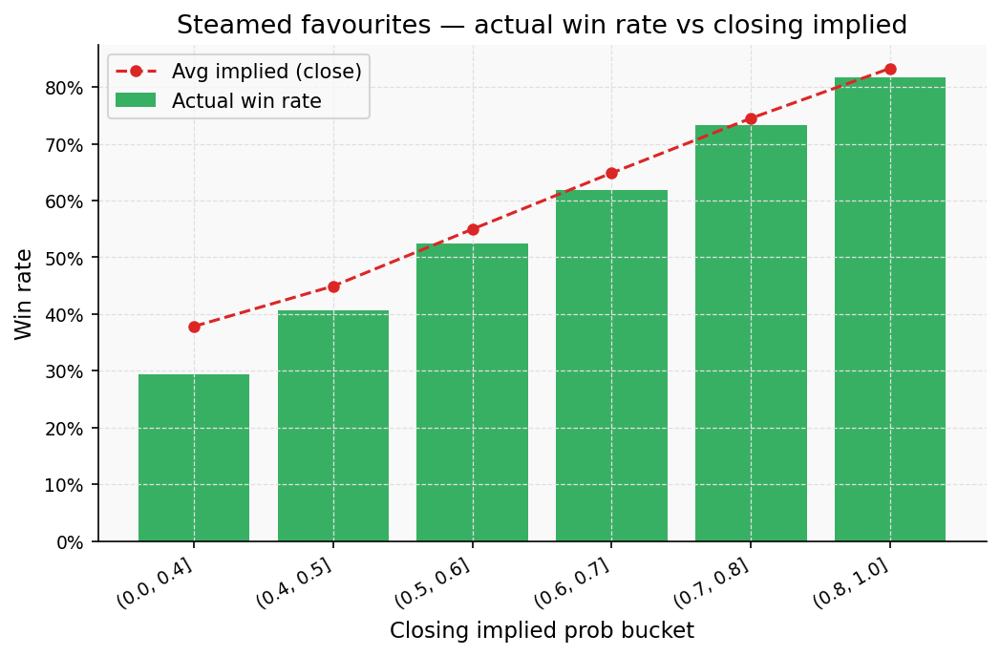
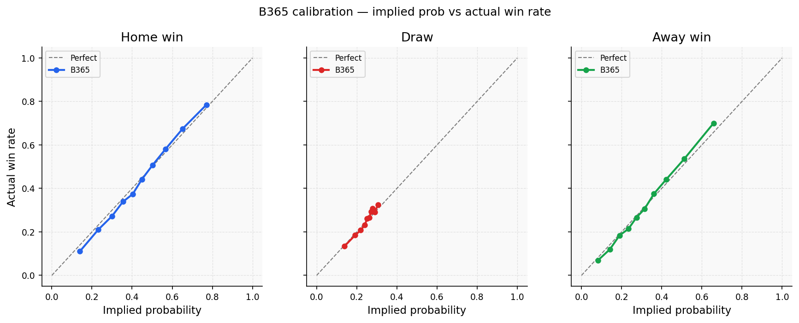
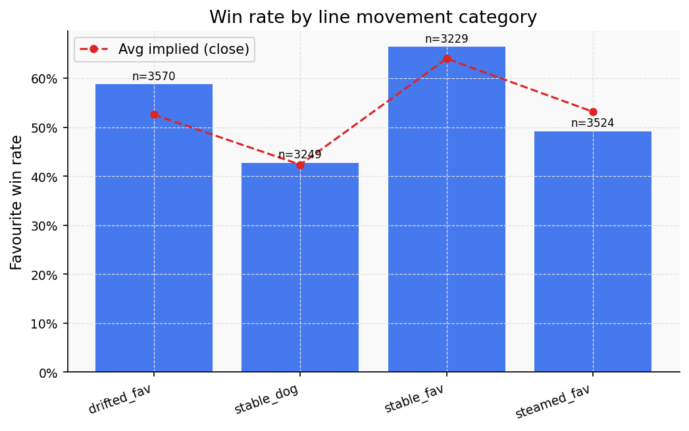
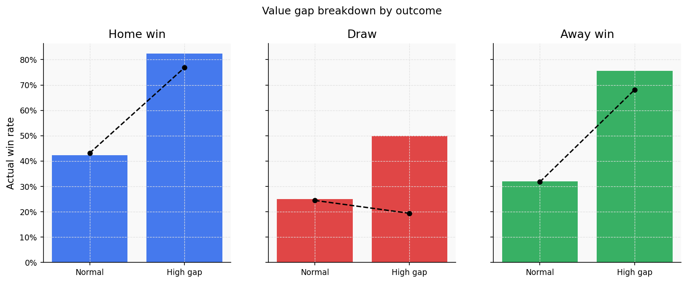
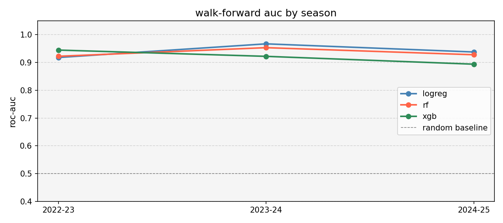
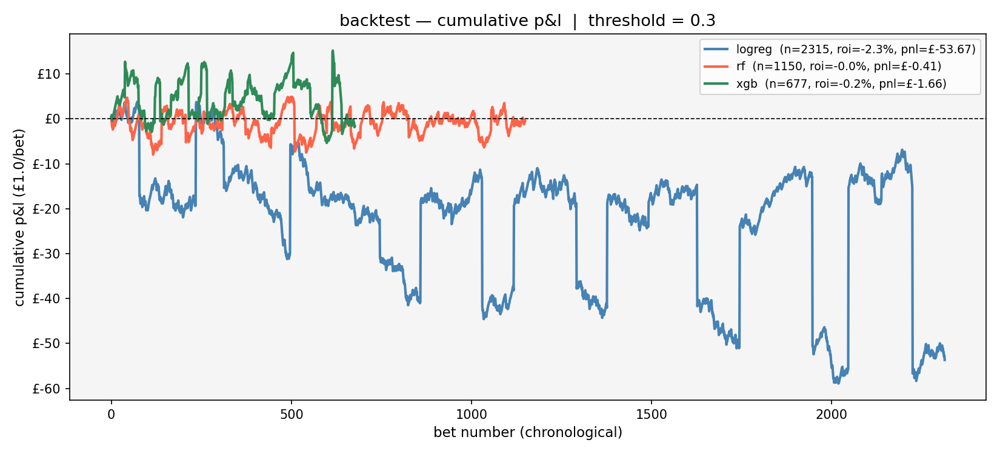

# bookie-audit

Poking at Bet365 odds data to see if their prices are actually as good as people claim, and whether the gaps between B365 and the wider market mean anything. 13,584 matches, 8 leagues, 5 seasons. Mostly just me messing around with some ML — but it's the groundwork for a larger project I'm building out.

## TL;DR

- **B365's odds are well-calibrated.** If they say 70%, it happens ~70% of the time. No obvious sloppiness.
- **When a favourite gets heavily backed and the odds shorten, they actually win *less* often than the price suggests.** The market overreacts to volume.
- **B365 occasionally prices an outcome more generously than every other bookmaker.** When that happens for home/away wins, the outcome is more likely than even their elevated price implies.
- **A simple logistic regression can predict when this happens** — AUC ~0.94 out-of-sample across 3 seasons.
- **But you still can't beat the vig.** ROI hovers near zero. The edge exists, the bookmaker just charges enough to eat it.

## Why I built this

Wanted to know if "bookmaker inefficiency" is a real measurable thing or just cope. B365 gets cited as a ground-truth probability benchmark in a lot of sports analytics research — but they're also a business that shades odds to manage risk. Those two things can't both be fully true at the same time.

So: when B365 is out of line with every other bookmaker, is that a signal — or just noise? Turns out it's a signal. Just not a profitable one (yet).

### Steamed favourites underperform their closing line by ~5–8pp



## What it actually does

It loads historical odds CSVs (football-data.co.uk format), engineers a bunch of odds-derived features, and runs three analytical layers plus an ML layer.

- **Calibration:** Brier scores + calibration curves to check if B365's implied probs match observed frequencies. They do — almost perfectly.
- **Line Movement:** Categorises each match by how the B365 odds moved open-to-close (steamed, drifted, stable). Tests whether movement direction predicts whether the closing line over- or under-shoots.
- **Value Gap:** Flags matches where B365's closing price is >3pp more generous than the best available market price. Tests whether that gap predicts outcomes.
- **ML:** Logistic Regression, Random Forest, and XGBoost trained to predict the high-gap flag. Evaluated with walk-forward validation (train on past seasons, predict forward) and a return simulation net of vig.

**Note on the ML:** Single-split AUC was 0.952, which looked great. Walk-forward dropped it to ~0.941 — barely any change, which is actually reassuring rather than suspicious. The backtest is where reality hits: near-zero ROI across all thresholds. The model finds the pattern but can't beat the vig.

## Setup

```bash
pip install -r requirements.txt
python main.py
```

I've left one sample season in data/raw/ (E0_2021.csv) so the script runs straight out of the box.

To replicate the full 13,000+ match analysis, download the historical odds CSVs from football-data.co.uk and drop them into the `data/raw/` folder. The script expects the standard `B365H/D/A`, `PSH/D/A`, `MaxH/D/A` and `B365CH/CD/CA` columns. 

Outputs go to `output/plots/` and `output/results/`.

## Key findings

**B365's calibration is essentially perfect.** Implied probs match observed frequencies tightly across all five seasons, all three outcome types. Not what I expected going in.



**Steamed favourites underperform their closing line.** When sharp money piles in and a favourite's odds shorten significantly, they actually win *less* often than the closing price suggests. The market overreacts to volume. This was the most interesting result.



**The value gap is real.** When B365 is >3pp more generous than the market-wide best price, home and away wins happen at a much higher rate than even the elevated implied prob would predict. Draws invert — B365 being generous on a draw means it's less likely to land.



**The gap is predictable out-of-sample.** Walk-forward AUC stayed at ~0.94 across three test seasons. Linear model beat the tree methods, which suggests the relationship is straightforward rather than complex.



**But the vig eats it.** ROI across all thresholds hovers near zero. Strike rate climbs cleanly from 66% to 79% as you raise the model threshold — so the ranking is real — but average odds shrink just as fast and the vig absorbs the margin.

| Threshold | Bets | Strike rate | ROI |
|---|---|---|---|
| 0.1 | 4,087 | 66.2% | -0.8% |
| 0.3 | 2,315 | 72.3% | -2.3% |
| 0.5 | 1,588 | 77.5% | +0.2% |
| 0.6 | 1,186 | 79.3% | -0.6% |



**Counterintuitive result:** "I found the inefficiency but can't exploit it" is actually the correct answer for a well-functioning market. It's a more interesting conclusion than finding fake alpha.

## Tech

- Python 3.10+
- `scikit-learn` / `xgboost` for the models
- `pandas` / `numpy` for everything else
- `matplotlib` for the viz

## License

MIT, just don't sell it (unless I get 5%).